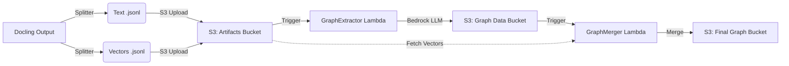

# Serverless Graph RAG Pipeline

A decoupled, event-driven pipeline built with AWS SAM that processes document chunks to create a Knowledge Graph enhanced with Vector Embeddings.

This pipeline automates the ingestion flow for **GraphRAG** applications: isolating text for LLM entity extraction and merging the results back with dense vector embeddings for downstream retrieval.

## 🏗 Architecture

The pipeline consists of three decoupled stages:

1. **Splitter (Upstream):** Pre-processes Docling outputs, separating heavy vector embeddings from text/metadata.
2. **Graph Extractor (Lambda - Python 3.12):** Triggered when text files land in S3. It uses **AWS Bedrock** to extract nodes and edges based on a semantic schema.
3. **Graph Merger (Lambda - Docker):** Triggered when graph data is ready. It retrieves the original vector embeddings and merges them with the new graph structure into a "gold standard" JSONL file.



## 📂 Project Structure

```text
/
├── template.yaml                 # AWS SAM Infrastructure definition
├── samconfig.toml                # Deployment configuration
├── graph_extractor/              # Step 1: LLM Extraction Service
│   ├── app.py                    # Extraction logic (Bedrock)
│   ├── requirements.txt          # Dependencies (boto3, PyYAML)
│   └── schema_contract.yaml      # (Optional) Graph Schema definition
└── graph_merger/                 # Step 2: Data Merge Service
    ├── app.py                    # Merge logic
    ├── Dockerfile                # Container definition (for large memory tasks)
    └── requirements.txt          # Dependencies (boto3)

```

## ✅ Prerequisites

* **AWS CLI** configured with Administrator permissions.
* **AWS SAM CLI** installed.
* **Docker** (Desktop or Podman) running (required for building the Merger image).
* **Python 3.12** installed locally.

## 🚀 Deployment

1. **Build the Application**
This uses a hybrid build: local Python for the Extractor (speed) and Docker for the Merger (isolation).
```bash
sam build

```


2. **Deploy to AWS**
Run the guided deployment to set up the stack.
```bash
sam deploy --guided

```


* **Stack Name:** `split-chunk-graph`
* **Region:** `us-east-1` (or your Bedrock supported region)
* **Parameter Overrides:** Accept defaults or customize bucket names.


## ⚙️ Configuration

### 1. S3 Triggers (Manual Step)

Because the input bucket (`my-docling-output-artifacts-2025`) is an **existing external bucket**, SAM cannot automatically attach the event trigger.

1. Go to the **AWS Lambda Console**.
2. Open `split-chunk-graph-GraphExtractorFunction`.
3. Click **Add Trigger** -> **S3**.
* **Bucket:** `my-docling-output-artifacts-2025`
* **Suffix:** `_text.jsonl`


4. Save.

### 2. Environment Variables

You can adjust these in `template.yaml` or via the AWS Console:

* **LLM_MODEL:** Defaults to `amazon.titan-text-express-v1`.
* *Recommended:* `amazon.titan-text-premier-v1` or `anthropic.claude-3-haiku-20240307-v1:0` for better graph quality.


* **VECTOR_BUCKET:** The bucket where your upstream splitter saves vector files.

## 📥 Usage (Data Flow)

To process a document, ensure your **Splitter** creates two files with the following naming convention and uploads them to your artifact bucket:

1. **Text File:** `filename_text.jsonl`
* *Content:* `{"id": "doc_1", "text": "...", "metadata": {...}}`
* *Action:* Triggers the **Extractor**.


2. **Vector File:** `filename.jsonl` (or `filename_embeddings.jsonl` - configurable in Merger `app.py`)
* *Content:* `{"id": "doc_1", "embeddings": [...]}`
* *Action:* Pasively waits to be fetched by the **Merger**.


**Output:**
The final merged file will appear in the `graph-data-final` bucket as `filename_graph_upload.jsonl`.

## 🛠 Troubleshooting

* **"Bucket name should not contain '_'"**: S3 bucket names must use hyphens, not underscores. Ensure `template.yaml` uses `graph-data-final`.
* **"Circular Dependency"**: Ensure you are not using `!Ref BucketName` inside the IAM Policies of the same template. Use hardcoded names or separate parameters.
* **Empty Nodes/Edges**:
* Check CloudWatch logs for `JSONDecodeError`.
* Switch to a more capable model (e.g., Titan Premier or Claude).
* Verify the prompt in `graph_extractor/app.py` is receiving clean text (not embeddings).


* **Docker Build Hangs**: If `sam build --use-container` hangs on Windows, ensure `Runtime: python3.12` is set in the template for the Extractor and run `sam build` without the container flag.