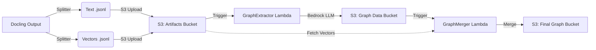

# Serverless Graph RAG Pipeline

A decoupled, event-driven pipeline built with AWS SAM that processes document chunks to create a Knowledge Graph enhanced with Vector Embeddings.

This pipeline automates the ingestion flow for **GraphRAG** applications: isolating text for LLM entity extraction and merging the results back with dense vector embeddings for downstream retrieval.

## 🏗 Architecture

The pipeline consists of three decoupled stages:

1. **Splitter (Upstream):** Pre-processes Docling outputs, separating heavy vector embeddings from text/metadata.
2. **Graph Extractor (Lambda - Python 3.12):** Triggered when text files land in S3. It uses **AWS Bedrock** to extract nodes and edges based on a semantic schema.
3. **Graph Merger (Lambda - Docker):** Triggered when graph data is ready. It retrieves the original vector embeddings and merges them with the new graph structure into a "gold standard" JSONL file.



## 📂 Project Structure

```text
/
├── scripts/                      # Local build/run scripts
│   ├── build.sh
│   └── run.sh
├── events/                       # Mock S3 event JSONs for local testing
├── graph_extractor/              # Step 1: LLM Extraction Service
│   ├── src/
│   ├── Containerfile             # Local Podman definition
│   └── schema_contract.yaml
├── graph_merger/                 # Step 2: Data Merge Service
│   ├── src/
│   └── Containerfile
├── splitter/                     # Step 0: Upstream Processor
│   ├── src/
│   └── Containerfile
├── template.yaml                 # AWS SAM Infrastructure definition
└── samconfig.toml                # Deployment configuration

```

## 💻 Local Development (Podman)

While `sam build` is used for AWS deployment, we use **Podman** for rapid local iteration and logic verification.

### 1. Prerequisites

* Podman installed.
* AWS Credentials in a `.env` file (required for `graph_extractor` to call Bedrock).

### 2. Setup Credentials

Copy the example env file:

```bash
cp .env.example .env

```

Fill in your `AWS_ACCESS_KEY_ID` and `AWS_SECRET_ACCESS_KEY`.

### 3. Build Functions

You can build all functions or a specific one:

```bash
# Build all
./scripts/build.sh all

# Build just the extractor
./scripts/build.sh graph_extractor

```

### 4. Run & Test (Mocking S3)

We simulate S3 triggers locally by passing JSON event files to the container.

1. **Create a Test Event:** Ensure you have a mock event in `events/s3_event.json` that matches the structure expected by your handler.
2. **Run the Script:**

```bash
# Test the Splitter
./scripts/run.sh splitter events/docling_output.json

# Test the Extractor (Calls Bedrock)
./scripts/run.sh graph_extractor events/s3_text_upload.json

```

---

## 🚀 AWS Deployment (SAM)

1. **Build the Application**

```bash
sam build

```

2. **Deploy to AWS**

```bash
sam deploy --guided

```

## ⚙️ Configuration

### 1. S3 Triggers (Manual Step)

Because the input bucket (`my-docling-output-artifacts-2025`) is an **existing external bucket**, SAM cannot automatically attach the event trigger.

1. Go to the **AWS Lambda Console**.
2. Open `split-chunk-graph-GraphExtractorFunction`.
3. Click **Add Trigger** -> **S3**.
* **Bucket:** `my-docling-output-artifacts-2025`
* **Suffix:** `_text.jsonl`


4. Save.

### 2. Environment Variables

* **LLM_MODEL:** Defaults to `amazon.titan-text-express-v1`.
* **CHUNKS:** The bucket where the upstream splitter saves chunked, embedded file based on source document.
* **TEXT+METADATA_VECTOR_BUCKET:** The bucket where the embedded file is split into two separate files, 1-text+metadata file and 2-vector embeddings file. 
* **FIRST GRAPH BUCKET** The bucket where the LLM generated nodes and entities file from the text+metadata file.
* **INTERMEDIATE GRAPH TEXT BUCKET** The bucket where the LLM generated nodes and entities are cobmined with the text+metadata file.
* **FINAL GRAPH BUCKET** The bucket where the zipped up file: 1-text+metadata file, 2-vector embeddings file, 3-graph nodes and edges. 
```

Key                 IntermediateBucketName
Description         Intermediate graph text bucket
Value               graph-data-text

Key                 FinalBucketName
Description         Final merged graph data bucket
Value               graph-data-final